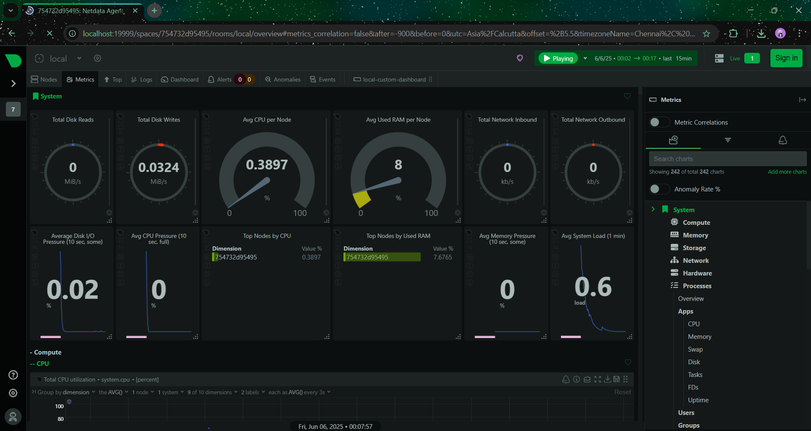
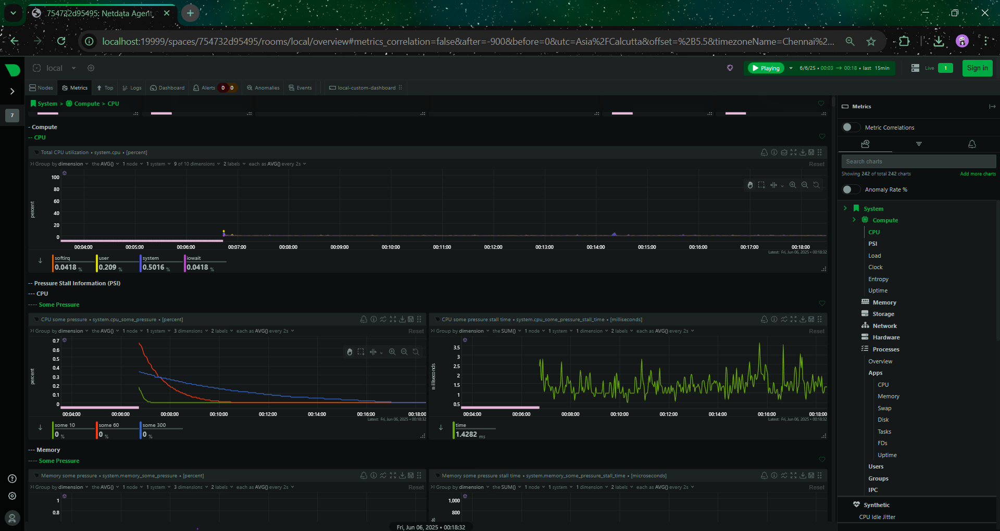
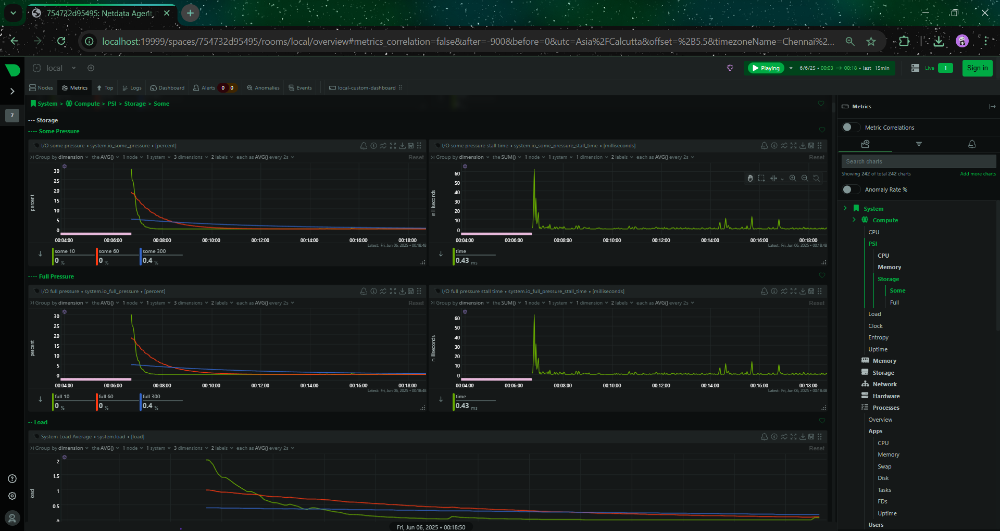
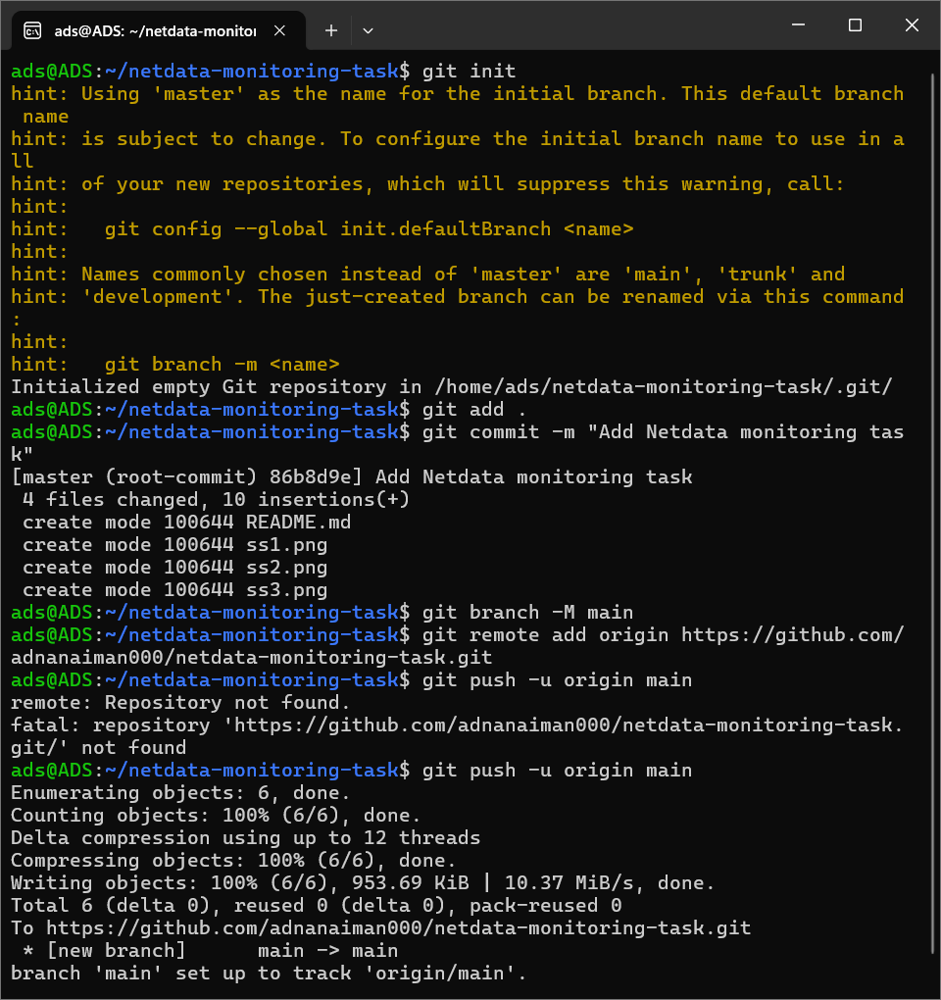

# Netdata Monitoring with Docker

## What is Netdata?
Netdata is a real-time monitoring tool that provides detailed performance metrics for systems and applications, including CPU, memory, disk I/O, and containers.

## How I Ran It
I used Docker inside WSL to run Netdata:

```bash
docker run -d --name=netdata -p 19999:19999 --cap-add=SYS_PTRACE --security-opt apparmor=unconfined netdata/netdata

## Screenshots








